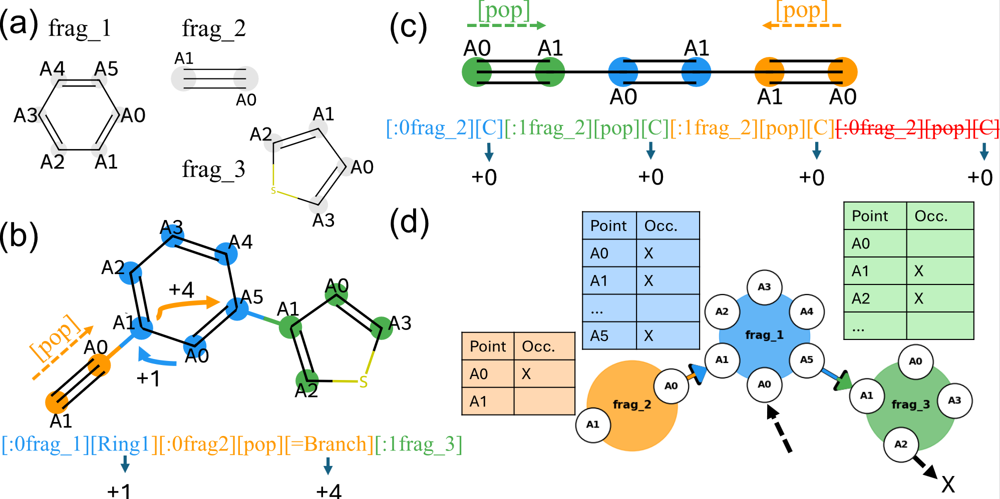

# Graph Group SELFIES (GGS)

GGS is a fragment-based molecular representation that guarantees chemical validity by construction. It extends [Group SELFIES](hztps://doi.org/10.1039/D3DD00012E) by representing molecules as **directed acyclic graphs (DAGs)** internally, while using the GS string format as its textual notation — making it directly compatible with existing GS/SELFIES decoders.


Figure 1: (a) fragment library, (b) molecule with GS string, (c) GS truncation failure, (d) GGS DAG with tracked valence.

## Why GGS?

| | SMILES | [SELFIES](github.com/aspuru-guzik-group/selfies) | [Group SELFIES](https://github.com/aspuru-guzik-group/group-selfies) | GGS |
|---|---|-------------|-------------------|---|
| Always valid | ✗ | post-hoc    | post-hoc          | ✓ by construction |
| Fragment-based | ✗ | ✗           | ✓                 | ✓ |
| No truncation artifacts | ✗ | ✗           | ✗                 | ✓ |
| Anchor positions (electrode) | ✗ | ✗           | ✗                 | ✓ |
| Synthetic data generation | ✗ | hard        | hard              | ✓ |
| Graph-level genetic ops | ✗ | ✗           | ✗                 | ✓ |

SELFIES and Group SELFIES enforce validity via a post-hoc parser that **truncates** sequences when attachment points run out, producing molecules different from the intended sequence. This creates reward aliasing and complicates learning. GGS tracks valence and free attachment points at every node during construction, so only chemically possible connections are ever made.

---

### Fragment Vocabulary

The vocabulary is a **manually curated set of stock reagents** — not mined from pharmaceutical datasets. Every generated molecule is composed of synthesizable building blocks, and the vocabulary can be tailored to the capabilities of a specific experimental partner.

---

### How a Molecule is Constructed

A molecule is built by chaining three types of tokens in sequence. At each step, the construction state tracks: the current graph, which node is "active", and which attachment point on that node is currently selected.

### Token types

**1. Fragment token** `[:S_in⟨fragN⟩]`

Places fragment N into the graph and bonds it to the currently selected attachment point of the active node. Sin selects which attachment point of the *new* fragment faces inward (toward the active node). After placement, the new fragment becomes the active node, with Sin as its current attachment point.

**2. Shift token** `[S_out]`

Does not place a fragment. Instead, shifts the currently selected attachment point on the active node by a fixed offset (determined by the token, see table below). Used to select a different attachment point before placing the next fragment — this is how branching and varied connectivity are expressed.

**3. Branch token** `[pop]`

Ends the current branch and returns the active node to the **parent** fragment (one level up in the DAG). The parent's attachment point is restored to where it was before the branch began.


The S_out shift tokens reuse the GS overloaded table:

| Token | Shift |   | Token | Shift |
|---|---|---|---|---|
| `[C]` | 0 | | `[=N]` | 8 |
| `[Ring1]` | 1 | | `[=C]` | 9 |
| `[Ring2]` | 2 | | `[#C]` | 10 |
| `[Branch]` | 3 | | `[S]` | 11 |
| `[=Branch]` | 4 | | `[P]` | 12 |
| `[#Branch]` | 5 | | | |
| `[O]` | 6 | | | |
| `[N]` | 7 | | | |

If S_in or S_out exceed the number of available attachment points on a fragment, **modulo arithmetic** is applied.

### Validity by construction

At every step the construction state knows exactly which attachment points are free. Fragment tokens are only allowed if the active node has a free attachment point, and the new fragment has a compatible S_in. This means **no generated GGS graph can produce an invalid molecule**.

> **Note:** GGS strings are not unique — multiple strings can encode the same molecule. Deduplication must happen at the graph or SMILES level, not the string level.

---

### Anchor Positions

The DAG has a designated **source node** (left electrode) and **sink node** (right electrode). Electrode anchor groups (e.g. gold-thiol) are attached directly to these nodes. This makes the molecule-electrode interface a first-class part of the representation and available to both the generative model and genetic operators. No other molecular representation handles this natively.

**Current limitations:** Maximum branch depth of 1 (no fragment can follow a side-branch node). Chirality and stereochemistry are not encoded.

---

### Synthetic Data Generation

Because GGS is valid by construction, random valid molecules can be generated purely algorithmically — no real dataset needed. Starting from a seed fragment, tokens are sampled stochastically while tracking the construction state, until `[end]` is reached or a token limit is hit. The resulting graph is serialized to a GGS string. This enables pretraining generative models from scratch in domains where no historical molecular data exists.

---

## Installation

```bash
pip install .
```

---

## Usage

### 1. Build a fragment grammar

A grammar is a vocabulary of molecular fragments. Each fragment is a SMILES string with attachment points marked as `[*:1]`, `[*:2]`, etc.

**From a fragment JSON dataset** (format: dict with keys `"block_name"` and `"block_smi"`):

```python
from GGS.create_grammar import create_grammar

create_grammar(
    json_path="./example/blocks.json",
    out_path="./example",
    grammar_name="my_grammar",   # writes ./example/my_grammar.txt
    filter_S=False,              # exclude sulfur-containing fragments
    filter_charge=False,         # exclude charged fragments
)
```

Also saves a PDF overview of all fragments sorted by atom count.

The grammar file format is one fragment per line: `frag_id  SMILES  formal_charge`.

### 2. Create a GGS object

Load the grammar **once** and reuse it — parsing the file is slow.

```python
from group_selfies import GroupGrammar
from GGS import GGS

grammar = GroupGrammar.from_file("./example/my_grammar.txt")

# From an existing encoding
ggs = GGS("[:0frag_2][C]", grammar=grammar)

# Generate a random valid molecule (up to 5 fragments, branching depth 2)
ggs = GGS(grammar=grammar)
ggs.create_random_genome(n_groups=5, n_explicit_pops=2)
print(ggs.encoding)
```

### 3. Access molecule properties

```python
mol     = ggs.mol      # RDKit Mol object (lazy-loaded)
anchors = ggs.anchors  # [left_anchor_atom_idx, right_anchor_atom_idx]
n_atoms = ggs.get_num_atoms()
print(ggs)             # prints the GGS encoding string
```

`mol` and `anchors` are computed on first access and cached.

### 4. Visualise and validate

```python
ggs.draw_mol()                       # 2D depiction
ggs.draw_mol(draw_atom_numbers=True) # with atom index labels

from GGS import validate_molecule
is_safe, reasons = validate_molecule(ggs.mol)
# reasons lists any forbidden substructures found (peroxides, strained rings, etc.)
```

### 5. Generate a 3D structure

```python
mol_3d, anchors_3d = ggs.create_3d_structure(
    save_xyz=True,
    save_path="./output/mol.xyz",
    anchor_mode="AuS",  # "AuS" | "thiol" | "AuS_just_left" | "No"
)
```

The XYZ file has anchor atom indices on line 2 so downstream codes can read them directly.

### 6. Genetic operations

All mutation methods accept `return_new_object=True` to return a new `GGS` instance without modifying the original.

```python
# Replace a fragment with a compatible alternative
child = ggs.group_mutation(return_new_object=True)

# Change which attachment point a bond connects to
child = ggs.bond_mutation(return_new_object=True)

# Insert a new fragment in the middle of the chain
child = ggs.insert_group_mutation(return_new_object=True)

# Add a side branch
child = ggs.insert_branch_mutation(return_new_object=True)

# Remove a fragment
child = ggs.truncate_mutation(return_new_object=True)

# Crossover between two molecules
c1, c2 = GGS.single_point_crossover(ggs_a, ggs_b, return_new_object=True)
```

Other available mutations: `anchor_pos_mutation`, `anchor_group_mutation`, `insert_start_end_group_mutation`.
