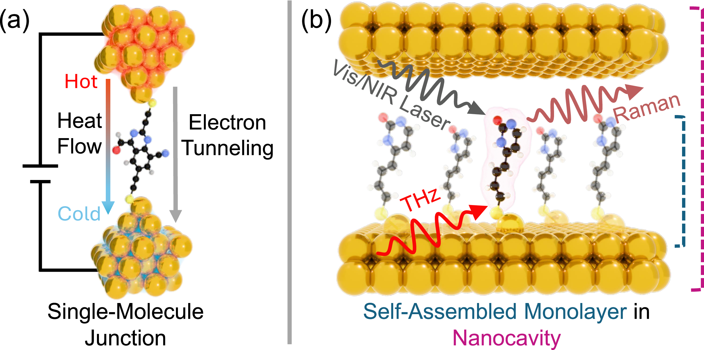

# The Nanotechnology Molecular Optimization (NMO) Benchmark

## Table of Contents
- [What NMO is about](#what-nmo-is-about)
- [Why it is interesting & Why now](#why-it-is-interesting--why-now)
- [The Machine Learning Challenges](#the-machine-learning-challenges)
- [Installation](#installation)
- [NMO Benchmark — Oracle Handler](#nmo-benchmark--oracle-handler)
  - [Minimal Example: Handling SMILES Strings](#minimal-example-handling-smiles-strings)
    - [Custom Anchor Positions](#custom-anchor-positions)
  - [Minimal Example: Handling GGS Strings](#minimal-example-handling-ggs-strings)
  - [Produced Output Files](#produced-output-files)
    - [`<hash>/metadata`](#hashmetadata)
    - [`<hash>/phonon`](#hashphonon)
    - [`<hash>/electronic`](#hashelectronic)
    - [`<hash>/terahertz`](#hashterahertz)
  - [Running the Benchmark Tasks](#running-the-benchmark-tasks)
    - [Predefined Configurations](#predefined-configurations)
    - [Analyzing the Results](#analyzing-the-results)
    - [Uploading Results](#uploading-results)
- [Performance Metrics](#performacne-metrics)
- [Benchmark Protocol](#benchmark-protocol)
- [Contributing Results](#contributing-results)
- [Advanced Usage](#advanced-usage)
  - [API Reference](API.md)
  - [Available Properties (`calculated_props`)](#available-properties-calculated_props)
  - [Parallelization](#parallelization)

## What NMO is about


*Molecular systems: 
    (a) A molecule contacted by gold surfaces on both sides forms a single-molecule junction for tuning thermal (Phonon Oracle) or thermoelectric transport (Thermoelectric Oracle). 
    (b) Molecules anchored on bottom gold surface (SAM) forming a nanocavity for THz detection via Raman scattering (Molecular Optomechanics Oracle).* 


NMO evaluates generative models on their ability to design functional molecules for three quantum physics tasks, as shown in **Figure 1**. It specifically targets **Single-Molecule Junctions (MJs)** for Phonon Heat Transport and Thermoelectrics, and **Self-Assembled Monolayers (SAMs)** for Molecular Optomechanics. To accurately evaluate these complex molecule-electrode systems, NMO replaces simple proxy scores with semi-empirical quantum simulations (via `xtb`) to directly compute their physical properties.

## Why it is interesting & Why now
Nanotechnology is rapidly transitioning from fundamental discovery to active device engineering, which means the primary bottleneck in the field has shifted from measurement to *design*. **The time for this benchmark is now.** NMO provides a standardized interface for the ML community to tackle these high-fidelity physical problems without needing deep domain expertise. By navigating real-world quantum constraints, like molecule-electrode binding, instead of heuristic proxies, models developed here go beyond leaderboard-chasing. They can drive direct scientific impact and discover novel materials for next-generation nanoscale devices.

## The Machine Learning Challenges

* **Rugged Fitness Landscapes:** Optimizing physical properties using quantum simulations creates extremely rugged fitness landscapes. These complex loss landscapes cause high training instability. As shown in the paper, standard models easily suffer from catastrophic forgetting and mode collapse due to the high variance gradients produced by these physical oracles.
* **Hard Structural Constraints:** The NMO benchmark requires modeling the binding of molecules to macroscopic gold surfaces. This introduces hard structural constraints to form a valid junction geometry. Standard molecular representations like SMILES fail at these tasks because they cannot natively model the required anchor positions or the two sided electrode binding.

## Installation
Create a conda environment with Python 3.11:
```bash
conda create -n nmo python=3.11
```

Install xtb via conda:
```bash
conda install -c conda-forge xtb==6.7.1
```

Then install the NMO benchmark and its dependencies:
```bash
pip install ./
```

When running the Molecular Optomechanics oracle, a special version of xtb is needed. 
The files are provided in `./external_packages/xtb/`, including a precompiled binary for Linux `./external_packages/xtb/build/xtb` (requires MKL runtime).
After installation, set the environment variable `XTB_PTB_BIN` to point to the external xtb binary.

Precomputed electrode data is required for transport calculations. Cd to `./data/` and download it via:
```bash
cd ./data/
git clone https://huggingface.co/datasets/guise868/electrode_data
```


## NMO Benchmark — Oracle Handler

The `Oracle_Handler` provides a unified interface for evaluating molecules on the NMO benchmark. It is designed to score batches of molecules and compute a fitness value.
It is a powerful tool that handles all the complexities of the underlying quantum simulations, including geometry optimization, transport calculations, and error handling.
First we show how to integrate the oracle handler into your code and basic usage.
Further below we explain how to run the predefined NMO benchmark tasks.

Note that an interface to [tdc](https://github.com/mims-harvard/TDC) oracles is also implemented for testing and development of models (check details [here](#advanced-usage-available-properties-calculated_props)).

Two variants are provided:
- **`Oracle_Handler_GGS`** — input is a list of Group SELFIES strings (requires a grammar)
- **`Oracle_Handler_Smiles`** — input is a list of SMILES strings

### Minimal Example: Handling SMILES Strings

The oracle handler reads its settings from a `.ini` config file. A minimal example for evaluating electronic transport properties from SMILES strings:

```ini
[Training]
log_dir = ./

[Oracle]
# Comma-separated list of properties to calculate.
# Options: SA, el_transp, ph_transp, tdc_<name> (any TDC oracle, e.g. tdc_qed, tdc_drd2)
calculated_props = SA,ph_transp

# Fitness function: a Python expression using the calculated property names.
# Available variables: SA (1=easy, 10=hard), G, S, k_el (from el_transp), k_ph, tdc_<name>
fitness_func = k_ph

# -1 means unlimited oracle calls
max_oracle_calls = -1

# The calculation of the properties is parallelized across multiple CPUs. 
# Set n_cpus_total to the number of CPUs you want to use for the calculations.
n_cpus_total = 4
```

Minimal example for using the Oracle Handler with SMILES input (also provided in `./examples/SMILES_minimal_example/smiles_minimal_example_phonon.py`):

```python
from NMO import Oracle_Handler_Smiles

oracle = Oracle_Handler_Smiles("./config.ini")

smiles = ["CC1=CC=C(C)C=C1", "C1=CC=CC=C1"]
fitness, rewards, oracle_calls_exceeded = oracle.get_fitness(smiles)

print("Fitness:", fitness)
# fitness is a scalar value per molecule, calculated from the `fitness_func` in the config file. 
# In this example, it would be the phononic heat conductance `k_ph`.
# If a molecule violates hard contraints, the fitness is set to zero
# Expected output: Fitness: [0.6521576 0.       ]
print("Rewards:", rewards)
# rewards is a dictionary of raw property scores per molecule.
# Expected output: 
# defaultdict(<function Oracle_Handler.get_rewards.<locals>.<lambda> at 0x7e543ed1f600>, 
# {'smiles': array(['[H]C([H])(C#CS[Au])C#CC([H])([H])C([H])([H])C#CS[Au]', ''], dtype='<U52'), 
# 'SA': array([4.9420986, 0.       ]), 
# 'hash_values': array(['5c325b588e2060d7b1d1c3ebdac64180', 'ac495aa1f8b37bd4547a041dcc917c1f'], dtype='<U32'), 
# 'hl_gaps': array([1.93795836, 0.        ]), 
# 'k_ph': array([0.6521576, 0.       ]), 
# 'failure_reasons': array(['', 'Gold is connected to multiple atoms'], dtype='<U35'), 
# 'oracle_calls': array([0, 1])})
print("Oracle calls exceeded:", oracle_calls_exceeded)
#Expected output: Oracle calls exceeded: False
```


#### Custom Anchor Positions

By default, the first and last heavy atoms of the SMILES string are used as anchor points (where the S-Au contacts are attached). Custom anchor positions can be passed via the `anchor_atoms` argument — using 0-based atom indices of the *original* SMILES molecule (before S-Au atoms are added). If an index is out of range for a given molecule, that molecule is marked as invalid (fitness 0) with a corresponding `failure_reason`.

```python
from NMO import Oracle_Handler_Smiles

oracle = Oracle_Handler_Smiles("./config.ini")

smiles = ["CC1=CC=C(C)C=C1", "C#CC#C"]

# Single pair applied to all molecules: atom 1 and atom 5 as anchors
fitness, rewards, _ = oracle.get_fitness(smiles, anchor_atoms=[0, 3])

print("Fitness:", fitness)
print("Rewards:", rewards)
# Expected output:
# Fitness: [0.         7.53752422]
# Rewards: defaultdict(<function Oracle_Handler.get_rewards.<locals>.<lambda> at 0x7fc751a06020>,
# {'smiles': array(['', '[Au]SC#CC#CS[Au]'], dtype='<U16'),
# 'SA': array([0.        , 5.86154593]),
# 'hash_values': array(['a20aab1e053b94e054f8792878828285', '932963deb37dc7fbbb306675bb93e002'], dtype='<U32'),
# 'hl_gaps': array([0.        , 1.66413959]),
# 'k_ph': array([0.        , 7.53752422]),
# 'failure_reasons': array(['Gold is connected to multiple atoms', ''], dtype='<U35'),
# 'oracle_calls': array([0, 1])})


smiles = ["C1=CC=CC=C1", "C1=CC=CC=C1", "C1=CC=CC=C1"]
# Per-molecule anchor pairs
fitness, rewards, _ = oracle.get_fitness(smiles, anchor_atoms=[[0, 1], [0, 2], [0, 3]])

print("Fitness:", fitness)
print("Rewards:", rewards)
# Expected output:
# Fitness: [ 0.         10.87074375 11.52433777]
# Rewards: defaultdict(<function Oracle_Handler.get_rewards.<locals>.<lambda> at 0x7fc751a06520>,
# {'smiles': array(['', '[H]c1c([H])c(S[Au])c([H])c(S[Au])c1[H]', '[H]c1c([H])c(S[Au])c([H])c([H])c1S[Au]'], dtype='<U38'),
# 'SA': array([0.        , 2.9630412 , 2.94935868]), 'hash_values': array(['ca6cde9557168e845192faa4703c0349', '2100e15ed5986aa7f722bd5f65b39b80','addb05358834caf57276fb190db6ef37'], dtype='<U32'),
# 'hl_gaps': array([0.        , 1.94183403, 1.74579176]),
# 'k_ph': array([ 0.        , 10.87074375, 11.52433777]),
# 'failure_reasons': array(['Gold is connected to multiple atoms', '', ''], dtype='<U35'),
# 'oracle_calls': array([2, 3, 4])})
```

### Minimal Example: Handling GGS Strings

The oracle handler reads its settings from a `.ini` config file. 
In the GGS case a grammar is needed that defines the molecular fragments.
A minimal example for evaluating electronic transport properties from GGS strings:

```ini
[General]
grammar_path = ./example_grammar.txt

[Training]
log_dir = ./

[Oracle]
# Comma-separated list of properties to calculate.
# Options: SA, el_transp, ph_transp, tdc_<name> (any TDC oracle, e.g. tdc_qed, tdc_drd2)
calculated_props = SA,ph_transp

# Fitness function: a Python expression using the calculated property names.
# Available variables: SA (1=easy, 10=hard), G, S, k_el (from el_transp), k_ph, tdc_<name>
fitness_func = k_ph

# -1 means unlimited oracle calls
max_oracle_calls = -1

# The calculation of the properties is parallelized across multiple CPUs. 
# Set n_cpus_total to the number of CPUs you want to use for the calculations.
n_cpus_total = 4
```

Minimal example for using the Oracle Handler with GGS input (also provided in `./examples/GGS_minimal_example/GGS_minimal_example_phonon.py`):


```python
from NMO import Oracle_Handler_GGS

oracle = Oracle_Handler_GGS("./config.ini")

ggs_strings = ["[:1frag_57][C][:0frag_17][pop][#Branch]",
          "[:0frag_41][Ring1][:0frag_0][Ring2]"]
fitness, rewards, oracle_calls_exceeded = oracle.get_fitness(ggs_strings)

print("Fitness:", fitness)
#Expected output: Fitness: [16.95707703  0.        ]
print("Rewards:", rewards)
#Expected output:
#Rewards: defaultdict(<function Oracle_Handler.get_rewards.<locals>.<lambda> at 0x728e3901fb00>, 
# {'smiles': array(['[H]C1=NC([H])=C2C(=N1)C(S[Au])=C(N([H])[H])C(S[Au])=C2[H]', ''], dtype='<U57'), 
# 'SA': array([3.48059744, 0.        ]), 
# 'hash_values': array(['ea7d8badd873edc446f90aa71918213d','68b16d9be5ef1295a02cca1276ac026a'], dtype='<U32'), 
# 'hl_gaps': array([1.29183941, 0.        ]), 
# 'k_ph': array([16.95707703,  0.        ]), 
# 'failure_reasons': array(['', 'xtb hessian output file missing or xtbhess.xyz present (xtb did not converge)'], dtype='<U77'), 'oracle_calls': array([0, 1])})
print("Oracle calls exceeded:", oracle_calls_exceeded)
# Expected output: Oracle calls exceeded: False

```

### Produced Output Files

NMO writes one HDF5 file per worker process to `log_dir`:

```
worker_<pid>_data.h5
```

Each evaluated molecule occupies a top-level group identified by its MD5 hash (unique identifier for each candidate) of the input encoding:

```
<md5_hash>/
    metadata/          # always present
    phonon/            # present if ph_transp calculated
    electronic/        # present if el_transp calculated
    terahertz/         # present if P_upconversion calculated
```

#### `<hash>/metadata`

Attributes stored for every molecule regardless of success or failure:

| Attribute | Type | Description |
|---|---|---|
| `encoding` | str | Original input encoding (GGS string or SMILES) |
| `smiles` | str | SMILES with S-Au anchor groups attached |
| `failure_reason` | str | Empty string if successful, error message otherwise |
| `hl_gap` | float | HOMO-LUMO gap in eV (`-1.0` if not available) |
| `oracle_call` | int | Global oracle call index |
| `fitness` | float | Fitness value (only written from `get_fitness()`) |

Scalar property values (e.g. `k_ph`, `G`, `S`, `k_el`, `ZT`, `P_upconversion`) are also stored as attributes here when available.

#### `<hash>/phonon`

Written when `ph_transp` is in `calculated_props` and the calculation succeeded.

| Entry | Type | Description |
|---|---|---|
| `transmission` (dataset) | float array `[N_E]` | Phonon transmission function |
| `energy_eV` (dataset) | float array `[N_E]` | Energy grid in eV |
| `atomic_numbers` (dataset) | int array `[N_atoms]` | Atomic numbers of the relaxed molecule |
| `positions` (dataset) | float array `[N_atoms, 3]` | Atomic positions in Å |
| `kappa` (attribute) | float | Phononic heat conductance in W/K |

#### `<hash>/electronic`

Written when `el_transp` is in `calculated_props` and the calculation succeeded.

| Entry | Type | Description |
|---|---|---|
| `transmission` (dataset) | float array `[N_E]` | Electronic transmission function |
| `energy_eV` (dataset) | float array `[N_E]` | Energy grid in eV |
| `atomic_numbers` (dataset) | int array `[N_atoms]` | Atomic numbers of the relaxed molecule |
| `positions` (dataset) | float array `[N_atoms, 3]` | Atomic positions in Å |
| `G` (attribute) | float | Electrical conductance in G₀ |
| `S` (attribute) | float | Seebeck coefficient in V/K |
| `k_el` (attribute) | float | Electronic heat conductance in W/K |
| `ZT` (attribute) | float | Thermoelectric figure of merit ZT at 300 K (requires `ph_transp`) |

#### `<hash>/terahertz`

Written when `P_upconversion` is in `calculated_props` and the calculation succeeded.

| Entry | Type | Description |
|---|---|---|
| `atomic_numbers` (dataset) | int array `[N_atoms]` | Atomic numbers of the relaxed molecule |
| `positions` (dataset) | float array `[N_atoms, 3]` | Atomic positions in Å |


### Running the Benchmark Tasks

#### Predefined Configurations
For running the tasks as defined in the paper, predefined config files are provided in `./data/configs/`:
* `config_phonon.ini` for the Phonon Heat Transport task
* `config_thermoelectric.ini` for the Thermoelectric Transport task
* `config_optomechanics.ini` for the Molecular Optomechanics task. Note that running this task requires setting the environment variable `XTB_PTB_BIN` to point to the external xtb binary with the corresponding upconversion calculation implemented.

#### Analyzing the Results

`scripts/analyze.py` post-processes the `worker_*.h5` files produced by a run. For each file it computes top-X fitness statistics over oracle calls, the AUC of the mean top-X fitness curve, and when `--oracle` is set counts candidates meeting oracle-specific relevance thresholds. When multiple files are present (e.g. multiple seeds), aggregate statistics are computed across all of them.

```bash
python scripts/analyze.py --input_dir ./logs --oracle phonon --top_x 10
```

| Argument | Default | Description |
|---|---|---|
| `--input_dir` | `.` | Directory containing `worker_*.h5` files |
| `--output_dir` | same as `input_dir` | Directory for output files |
| `--oracle` | `None` | Oracle type for relevance counting (`phonon`, `thermoelectric`, `optomechanics`) |
| `--top_x` | `10` | Number of top molecules tracked for AUC and statistics |

Per h5 file, the script writes a per-molecule CSV, a stats `.txt` with AUC and top-X values, and an `.svg` plot of fitness and SA over oracle calls. A `summary_top<X>.csv` aggregating all files is written when multiple h5 files are found.

## Performance Metrics

The goal of NMO is to maximize fitness under a strict budget of N fitness evaluations, similar to [Gao et al., 2022](https://arxiv.org/abs/2206.12411). This is a realistic setting where each oracle call represents a costly quantum simulation or experimental validation, emphasizing the importance of sample efficiency and practical utility.

We evaluate success with the following metrics:

- **Top-10 AUC:** The Area Under the Curve of the fitness scores of the top-10 molecules found up to iteration i, assessing both sample efficiency and candidate quality.
- **Mean Top-10 Fitness:** The average fitness of the ten best molecules after the optimization process, providing a direct measure of the quality of the best candidates discovered.
- **Mean Top-10 SA:** The average SA score of the top-10 candidates, a popular measure to estimate synthesizability. Scores above 4.5 are considered unlikely to be synthesizable.
- **Relevance Indicator (RI):** A binary indicator of whether a candidate's physical properties surpass the best molecules reported in the current scientific literature for the respective task, while maintaining an SA score below 4.5. If a method finds such relevant molecules for all three tasks, it demonstrates potential for genuine scientific impact beyond optimizing a mathematical proxy.

### Thresholds for Relevant Molecules

The following thresholds define highly relevant molecules for each task, based on a combination of literature values and synthetic accessibility considerations. The provided analysis scripts automatically check these thresholds to identify promising candidates.

- **Phonon (PH):** k_ph < 0.25 pW/K and SA < 4.5. Rivals the literature state of the art while ensuring synthesizability, overcoming the poor SA scores of theoretical baselines.
- **Thermoelectric (TE):** ZT > 3 (@300 K) and SA < 4.5. Exceeds the threshold for technological relevance. Same SA threshold as PH to ensure synthesizability.
- **Molecular Optomechanics (MO):** log P > 7.88 (xTB level) and SA < 4.5. Exceeds the highest value reported in the literature (7.88) while ensuring synthesizability with the same SA threshold as PH and TE.

## Benchmark Protocol

NMO is designed to test **generalist** optimization capability. A single method with a single configuration must navigate three physically distinct tasks without task-specific assistance.

### What is allowed
- The shared fragment library (GGS) — available equally to all methods on all tasks
- Methods operating on SMILES may use the provided GGS pretraining dataset translated into SMILES, preserving access to the curated fragment vocabulary without requiring the GGS interface
- For the phonon task, bounding the length of generated molecules to avoid a known degenerate oracle regime
- Cheap heuristic pre-filters (duplicate removal, unstable candidate removal) before fitness evaluation — filtered candidates count as zero fitness and do not consume budget

### What is not allowed
- Task-specific datasets or vocabularies
- Fitness evaluations before the main optimization loop (no informed starting points)
- Task-specific hyperparameter tuning — one configuration must be used across all three tasks

### Evaluation budget
- **10 000** fitness evaluations per seed
- Results must be averaged across **five consecutive seeds** — no cherry-picking

### Rationale
These constraints exist in response to observed exploitation patterns in design benchmarks. A method that succeeds under this protocol has demonstrated the ability to optimize molecules in a physical setting — not that it has been tuned to a specific task. Methods robust enough to generalize across physically distinct problems without fine-tuning are far more likely to be useful in real scientific applications.

## Contributing Results

Methods that find relevant molecules on **all three tasks** can be submitted to the benchmark via a pull request.

### Submission directory

Create `submissions/<your_method_name>/` containing:

```
submissions/
  <your_method_name>/
    README.md        ← required
    hyperparams      ← required (any plain-text format)
    grammar.txt      ← if your optimizer uses an explicit grammar or vocabulary
```

**`README.md`** should include:
- A short description of the method (algorithm, molecular representation, key design choices)
- Link to code repository and/or paper
- Performance metrics

**`hyperparams`** — the exact optimizer settings used across all three tasks (any plain-text format). This file is passed directly to `nomad/export_for_nomad.py --hyperparams`.

### Contribution workflow

1.  Fork the repository and create a branch `submission/<your_method_name>`.
2.  Run all three benchmark tasks using the standard config files from `examples/configs/`.
3.  Verify that your method produced at least one relevant molecule on each task
    (use `scripts/analyze.py` with `--oracle <task>`).
4.  Export and share your results. Two options are supported — see `nomad/README.md` for full details:
    - **NOMAD** (preferred): export `.archive.yaml` files with `nomad/export_for_nomad.py`, then upload as a draft with `nomad/upload_to_nomad.py`. Do not delete and re-upload after the PR is open — this changes the `upload_id` and breaks the review link.
    - **Hugging Face** (alternative): convert the same `.archive.yaml` files to a Parquet dataset with `nomad/convert_to_parquet.py` and push to the Hub as a **public** dataset.
5.  Open a pull request with your `submissions/<your_method_name>/` directory.
    - **NOMAD path:** include the draft upload URL and `upload_id` in the PR description.
    - **Hugging Face path:** include the public dataset URL in the PR description.
6.  *(NOMAD path only)* A maintainer will reply with their NOMAD username — add them to the
    "Shared with" field on your NOMAD upload so they can inspect the data.
7.  Address any review feedback via additional commits to your branch.
8.  Once the maintainers are satisfied with the data and the submission files, create a DOI
    and add it to your `README.md` as a final commit to the branch.
    - **NOMAD path:** publish the upload via the NOMAD web UI — this makes it public and
      assigns a DOI automatically. Also add the NOMAD dataset URL to your `README.md`.
    - **Hugging Face path:** create a DOI for the already-public dataset via the Hugging Face
      web UI (*Dataset page → Settings → Create DOI*).
9.  The PR is approved and merged once the DOI commit is in place.
10. All accepted submissions are additionally bundled into a central NMO Benchmark dataset maintained by the repository owners, with its own DOI.


---

## Advanced Usage
The NMO enables the non-expert user to easily calculate complex quantum physics properties of molecules in nanotechnology-relevant contexts.
However, expert users can use the code to calculate and study the properties of their molecules of interest without needing to run an optimization loop (e.g. transport calculations).

For a full description of all public classes, properties, and methods — including `Electronic_Structure_Calculator`, `Electronic_Transport_Calculator_torch`, `Electronic_Transport_Estimator_torch`, and `Phononic_Transport_Estimator_torch` — see the **[API Reference](API.md)**.

### Available Properties (`calculated_props`)
Calculated properties depend on the `calculated_props` specified in the config file. 
Each property triggers the calculation of certain molecular properties:

| Property key | Description                                                                                                                                                                                                                      | Fitness variables |
|---|----------------------------------------------------------------------------------------------------------------------------------------------------------------------------------------------------------------------------------|---|
| `SA` | Synthetic accessibility score (1 = easy, 10 = hard to synthesize)                                                                                                                                                                | `SA` |
| `el_transp` | Electronic transport                                                                                                                                                                                  | `G` (conductance), `S` (Seebeck), `k_el` (electronic heat conductance) |
| `ph_transp` | Phononic transport                                                                                                                                                                                                               | `k_ph` (phononic heat conductance) |
| `P_upconversion` | Molecular Optomechanics properties (terahertz workflow, single-sided anchor, SAM structure). <span style="color:red">For calculating these properties a special xtb is needed (see ./external_packages</span>. | `P_upconversion`, `log_P_upconversion`, `log_P_upconversion_scaled` |
| `tdc_<name>` | Any [TDC oracle](https://github.com/mims-harvard/TDC) e.g. `tdc_qed`, `tdc_drd2`                                                                                                                                                 | `tdc_<name>` |

Multiple properties can be combined: `calculated_props = SA,el_transp,tdc_qed`.
**`P_upconversion` cannot be combined with `el_transp` or `ph_transp`** (different anchor geometry).

The `fitness_func` is a Python expression evaluated with these variables available, e.g.:
```ini
fitness_func = G * (10 - SA)
fitness_func = tdc_qed / SA
fitness_func = G + 0.5 * k_ph
fitness_func = log_P_upconversion / SA
```

### Parallelization

NMO uses two levels of parallelism:

**CPU parallelism — xtb calculations**

Geometry optimization and Hessian calculations are performed by `xtb`. The total number of CPU cores available to these calculations is controlled by `n_cpus_total`, shared across all molecules in a batch. We recommend setting this to the number of available cores:

```ini
[Oracle]
n_cpus_total = 8
```

**Oracle processes (`n_oracle_processes`)**

The config also accepts `n_oracle_processes`, which would split the batch across multiple worker processes using a greedy bin-packing scheduler. However, this path is currently disabled — all parallelism runs through `n_cpus_total`. We recommend keeping `n_oracle_processes = 1`.

```ini
[Training]
n_oracle_processes = 1
```

**GPU usage — transport calculations**

The transport calculations use [dxtb](https://github.com/dxtb/dxtb) and run on GPU if one is available, otherwise falling back to CPU. No configuration is needed — the device is selected automatically. When multiple oracle processes share a single GPU, NMO automatically limits the per-process GPU memory fraction to avoid out-of-memory errors.


