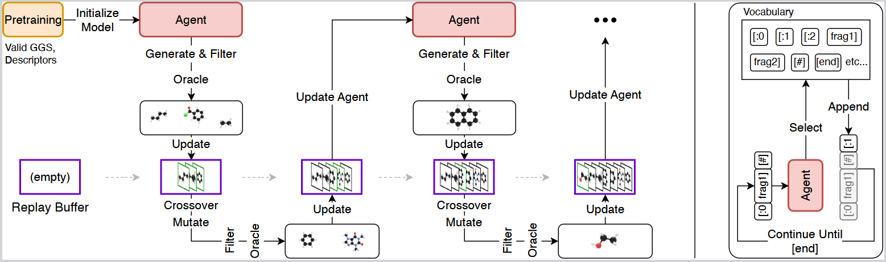

# Genetic GFN Framework

This repository contains the **baseline method** for the NMO Benchmark Suite, as described in *"Beyond Drug Discovery: The Nanotechnology Molecular Optimization (NMO) Benchmark"*. It extends the Genetic GFN baseline by Kim et al. [1] with four key contributions:

- **GGS Integration** — Replaces SMILES with Graph Group SELFIES (GGS) encoding, natively modeling molecule-electrode binding and guaranteeing chemical validity by construction
- **Synthetic Pretraining** — Pretrains on procedurally generated molecular graphs, eliminating pharmaceutical dataset bias
- **Transformer Architecture** — Replaces the GRU backbone with a transformer policy, augmented by an auxiliary molecular descriptor prediction head
- **Adaptive Stability Mechanisms** — Introduces Dynamic Cooldown (DCD) and Dynamic Exploration (DEX) to prevent training collapse in rugged physical fitness landscapes

The optimization workflow is depicted in the figure below:



## Table of Contents
- [Installation](#installation)
- [Encoding of the Molecules](#encoding-of-the-molecules)
  - [Provided Grammars](#provided-grammars)
- [Usage](#usage)
  - [Creating a Dataset](#creating-a-dataset-only-needed-for-ggs)
  - [Pretraining of the Agent](#pretraining-of-the-agent)
  - [Training of Agent](#training-of-agent)
    - [Config Files used for Experiments](#config-files-used-for-experiments)
    - [Checkpointing](#checkpointing)
  - [Analysis](#analysis)
- [Literature](#literature)

## Installation
 
Create virtual environment with tested python version (3.11.13.)
````
conda create -n "gflow_mol" python=3.11.13.
conda activate gflow_mol
````

Install the requirements with <br>
````
 pip install -r requirements.txt
````


## Encoding of the Molecules
Molecules can be encoded using SMILES or GGS.
For both a grammar is needed. 
The grammar defines valid actions. 
In the case of GGS, the grammar provides molecular fragments that can be used to build molecules. The following examples are privided in the data directory:
### Provided Grammars
#### GGS
- [minimal.](./data/GS_minimal_grammar.txt)
- [simple.](./data/GS_simple_grammar.txt)
- [complex.](./data/GS_complex_grammar.txt) 
- [benchmark](./data/GS_complex_grammar_without_S.txt): Grammar used for solving the NMO benchmark 
#### Smiles
- [smiles_voc](./data/smiles_voc.dat): Default Smiles vocabulary used for the NMO benchmark to represent the default [dataset](./data/mols_filtered.smi) (Taken from [2,4])
- [smiles_voc_adapted](./data/smiles_voc_adapted.dat): Smiles vocabulary used for the GGS translated to SMILES [dataset](./data/translated_smiles.smi).

## Usage

### Creating a Dataset (Only needed for GGS)
For the training of a Prior Agent, a dataset of valid molecules is needed. The dataset can be created using the [dataset](./dataset.py) script.
Note that the dataset contains only valid molecules. Right now this is only important for GGS as we use the dataset
[mols_filtered.smi](./data/mols_filtered.smi) for SMILES from [2,4]. 
````
python dataset.py PATH_TO_CONFIG_FILE
````
Optional arguments:
- --seed N: Random seed for dataset creation. Without this argument no seed is set.
- --gpu N: Use GPU N
- --n_jobs N: number of parallel workers for generation (defaults to 1). This is especially important for large datasets.

Example minimal config file for this step:
````
[General]
encoding_type = GGS
#Maximum length of action sequence
max_seq_length = 30
#Path to Grammar file. Must match the encoding_type
grammar_path = 

[Dataset]
#path and filename of created dataset (e.g XXXX/dataset.pt)
dataset_path = 
#Size of the dataset
size = 300000 
#number of GGS fragments to use at max. max_seq_length should be approx. 3*n_groups
n_groups = 10 
#Number of explicit pops to use in the dataset
n_explicit_pops = 5 
#If true descriptors are calculated and included in the dataset
include_descriptors = False
#If true only molecules that pass SMARTS filters are included in the dataset.
use_SMARTS_filters = False
````

### Pretraining of the Agent
A Prior Agent is needed to generate molecules. The Prior Agent is trained using the [pretrain](./pretrain.py) script.
````
python pretrain.py PATH_TO_CONFIG_FILE
````
Optional arguments:
- --seed N: Random seed for dataset creation. Without this argument no seed is set.
- --gpu N: Use GPU N

Example minimal config file for this step:
````
[General]
encoding_type = GGS or Smiles
#Maximum length of action sequence
max_seq_length = 30
#Path to Grammar file. Must match the encoding_type. 
grammar_path = 
#Total number of layers regardless of the model (Must be > 1)
num_layers = 4
#Hidden dimension of the model
d_model = 256
#Model Name -> transformer or rnn
model = transformer

[Pretrain]
#path to dataset
dataset_path = 
epochs = 4
batch_size = 512
#Path where prior agent is saved -> will be saven as XXXX/prior.pt
output_path = ./
learning_rate = 1e-3
plot_loss = True
save_logs = True
#loss weight for the auxiliary descriptor prediction head. If set to 0, the head is not trained at all.
loss_weight = 0.0
````


### Training of Agent
The Agent is trained using the [train_agent](./train.py) script. The config file is needed as well. 
````
python pretrain.py PATH_TO_CONFIG_FILE
````
Optional arguments:
- --seed N: Random seed for dataset creation. Without this argument no seed is set.
- --gpu N: Use GPU N

````
[General]
encoding_type = GGS or Smiles
#Maximum length of action sequence
max_seq_length = 30
#Path to Grammar file. Must match the encoding_type. 
grammar_path = 
#Total number of layers regardless of the model (Must be > 1)
num_layers = 4
#Hidden dimension of the model
d_model = 256
#Model Name -> transformer or rnn
model = transformer

[Training]
#path to pretrained model
prior_path = 
#directory where training logs and results are saved
log_dir = 
#batch size of sampled sequences
batch_size = 64
#rank coefficient of sampling
rank_coefficient = 0.01
#learning rate for the agent policy network
learning_rate = 0.0005
#learning rate for the GFlowNet partition function Z
learning_rate_z = 0.1
#maximum gradient norm; set to inf to disable
gradient_clipping = 10

#special options for adaptive stability mechanisms
#(DEX) increases rank_coefficient when no new best molecule is found to boost exploration
dynamic_explor_exploit = True
#(DCD) applies a cooldown after oracle calls to prevent training collapse
dynamic_cooldown = True
#rank coefficient used during DEX exploration phase (should be > rank_coefficient)
exploration_rank_coeff = 0.1
#option for extended output writing
debug = True

[Replay Training]
#maximum number of molecules stored in the replay buffer
memory_size = 1024
#number of molecules sampled from the replay buffer per step
experience_replay = 64
#number of replay training steps per environment step
n_experience_iterations = 8
#reward shaping coefficient; scales the fitness scores
beta = 30
#weight of KL divergence penalty against the prior
kl_coefficient = 0.0
#weight of auxiliary descriptor prediction loss during training
descriptor_weight = 0.0

[Genetic Search]
#enable or disable the genetic search component entirely
genetic_search = True
#number of molecules in the GA mating pool
population_size = 64
#probability of mutating a fragment in an offspring
mutation_rate = 0.5
#probability of crossover vs. pure mutation
crossover_rate = 0.5
#number of GA generations run per training step
ga_generations = 2
#number of new molecules generated per GA generation
offspring_size = 8

[Oracle]
# see options described in NMO repo


````

#### Config Files used for Experiments
* All config Files used for the experiments in the paper can be found in the [configs](./data/experiments/) directory.
* We note that the dataset used in the experiments is deterministically created with the [dataset](:/dataset.py) script using seed 0 (even when the run itself uses another seed). The pretraining for all seeds is also done with the pretraining seed 0.
* To reproduce our results run pretrain with the provided configs and seed 0. Then run the train script with the seeds shown in the corresponding config file.

#### Checkpointing
Training automatically saves a checkpoint to `log_dir` and resumes from it if one already exists there, making restarts transparent. Each checkpoint captures the full reproducible state: model weights, optimizer, partition function Z, oracle call count, replay buffer, full molecule history, and all RNG states (PyTorch, CUDA, NumPy, Python, trainer). On Slurm clusters the checkpoint handler additionally monitors remaining job time and saves proactively when less than 50 minutes remain (default threshold), enabling seamless job requeuing without losing progress.

### Analysis
For the analysis some scripts are provided in the [analysis](./analysis) directory. The scripts can be used as python modules or as standalone scripts.

- [check_dataset.py](./analysis/check_dataset.py): This script can be used to check the properties of the dataset (e.g. tdc_albuterol_similarity in the dataset).
  ````
  python check_dataset.py PATH_TO_CONFIG_FILE
  ````
- [sample_agent.py](./analysis/sample_agent.py): This script can be used to sample molecules from a trained agent and analyze the properties of the sampled molecules ->Distribution learing.
  ````
  python sample_agent.py PATH_TO_CONFIG_FILE N_SAMPLES prior/final
  ````
  optional arguments:
    - --seed N: Random seed for dataset creation. Without this argument no seed is set.
    - --gpu N: Use GPU N
- [GroupSelfies_dataset_to_smiles.py](./analysis/GroupSelfie_dataset_to_smiles.py): This script can be used to convert a GroupSelfies dataset to smiles dataset for comparison.
  ````
  python GroupSelfies_dataset_to_smiles.py PATH_TO_CONFIG_FILE
  ````
- [plot_histograms.py](./analysis/plot_histograms.py): This script can be used to plot histograms of the properties of the sampled molecules.
  ````
  python plot_histograms.py PATH_TO_RUN MODE
  ````
- [eval_diversity_novelty.py](./analysis/eval_diversity_novelty.py): This script can be used to evaluate the diversity and novelty of the sampled molecules, the dataset and the top_x molecules. The corrsponding input files have to be created with check_dataset.py and sample_agent.py.
  ````
  python eval_diversity_novelty.py dataset_stats_path full_history_path [<sampled_stats_path>]
  ````


# Literature
[1] Kim, H., Kim, M., Choi, S., & Park, J. (2024). Genetic-guided GFlowNets for sample efficient molecular optimization. Advances in Neural Information Processing Systems, 37, 42618-42648.

